# ChatPotion

**ChatPotion** is a polished theme collection for [The Lounge](https://thelounge.chat/), focused on clean dark UI, readable chat layouts, improved mention indicators, and Halloy-inspired sidebar styling.

## Preview

### Featured Themes

| Deep Sea Cyan | Gruvbox Material |
|---|---|
| 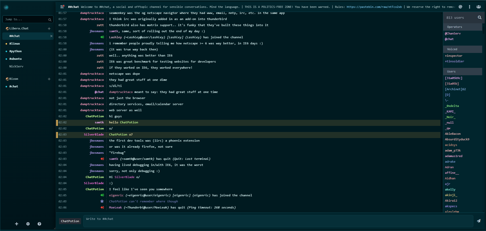 | 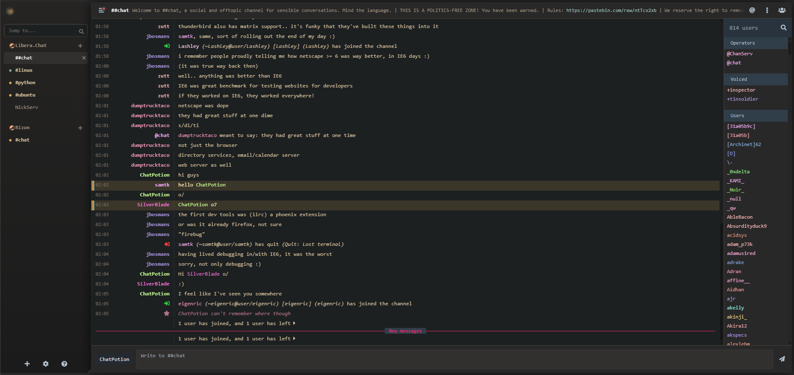 |

| Tokyo Night | Catppuccin Mocha |
|---|---|
| 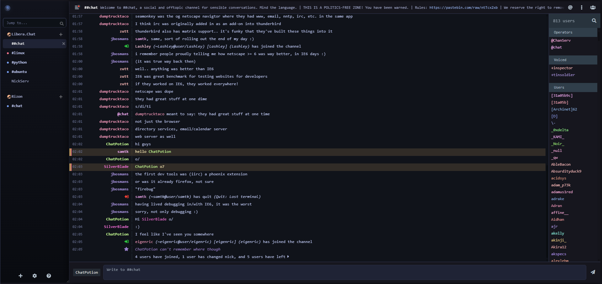 | 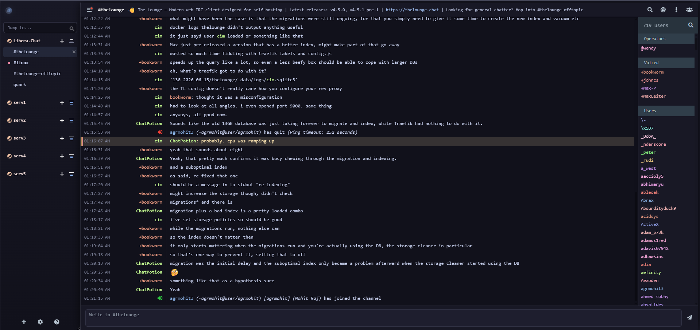 |

<details>
<summary>View all theme previews</summary>

<br>

| Theme | Preview |
|---|---|
| Arctic Aurora | 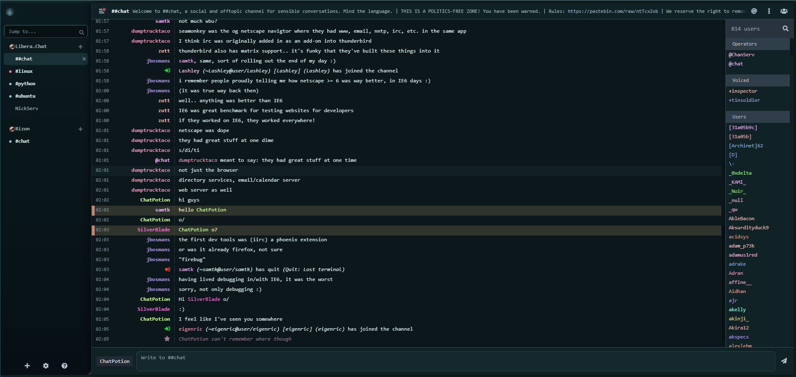 |
| Ayu Mirage | 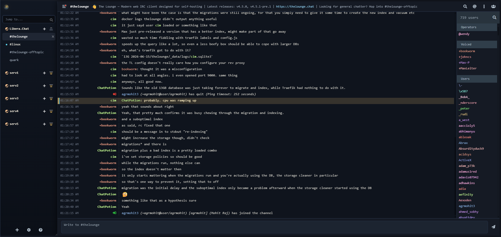 |
| Catppuccin Mocha |  |
| Crimson Noir | 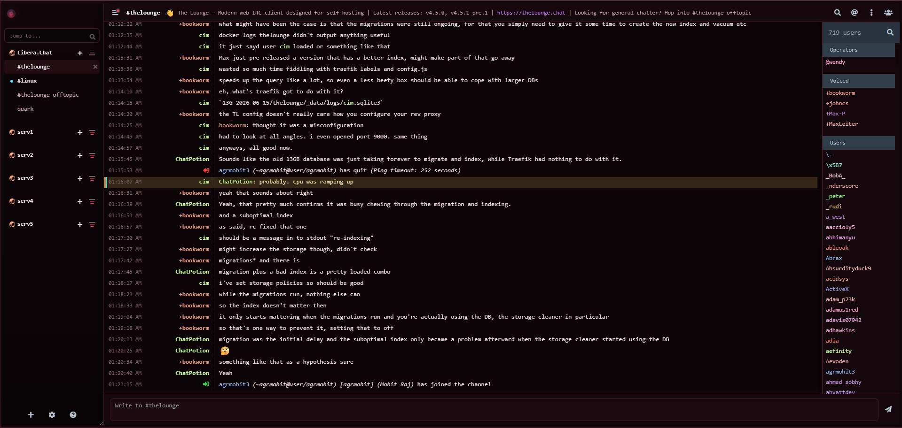 |
| Cyberpunk Neon | 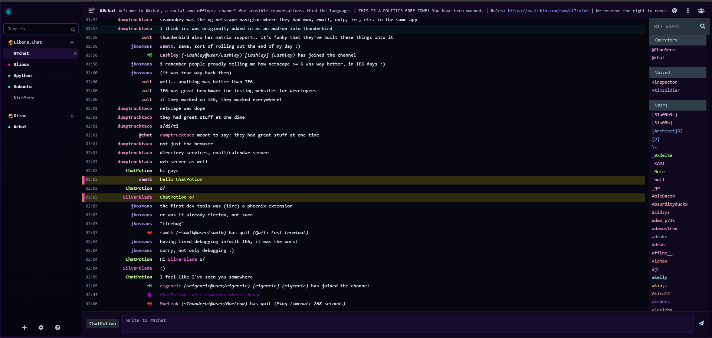 |
| Deep Sea Cyan |  |
| Dracula Soft | 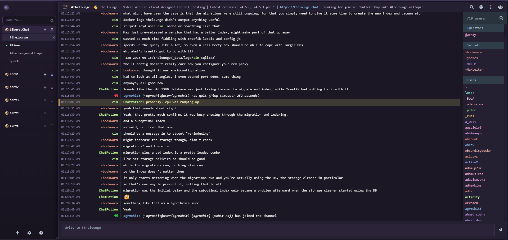 |
| Everforest Dark | 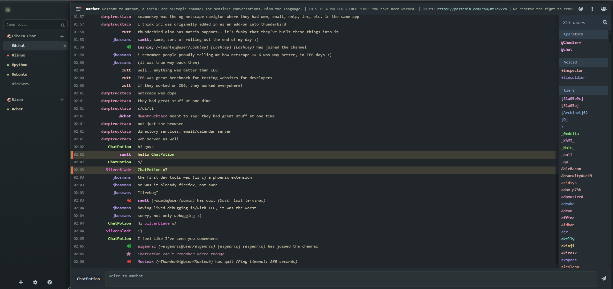 |
| Forest Night | 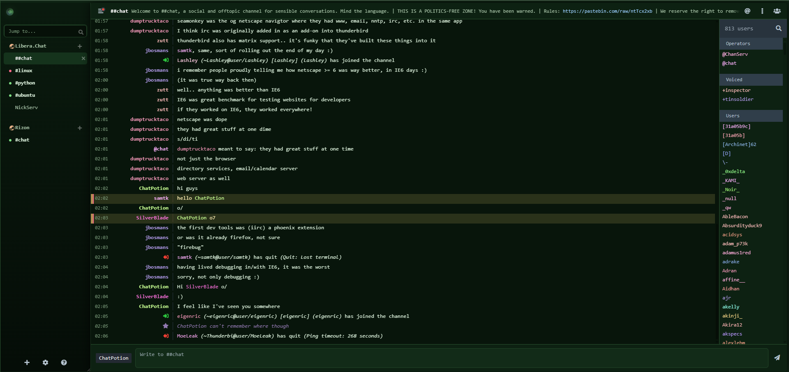 |
| GitHub Dark | 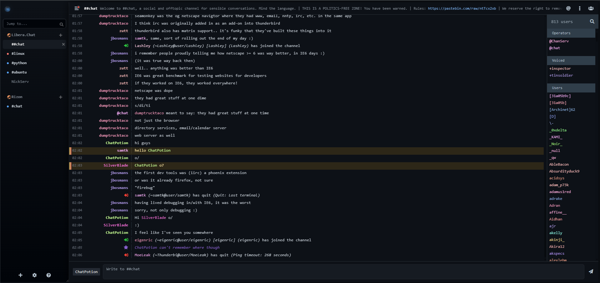 |
| Gruvbox Material |  |
| Kanagawa Wave | 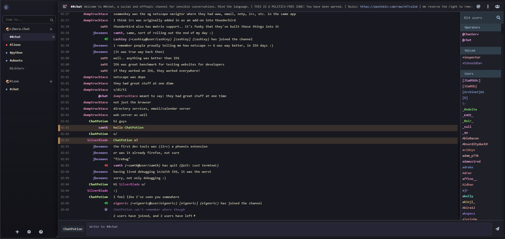 |
| Matrix Terminal | 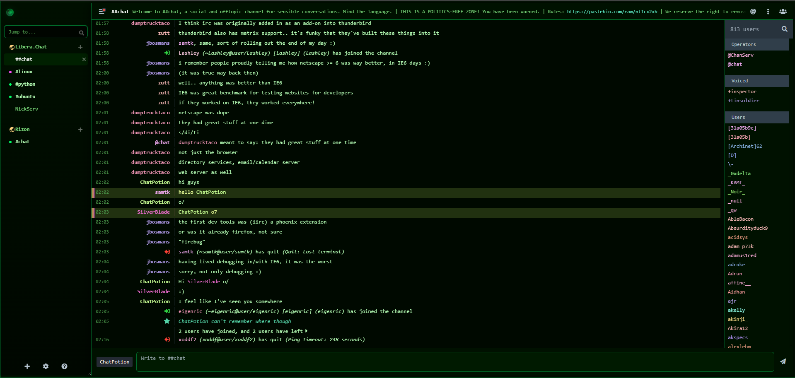 |
| Midnight Sapphire | 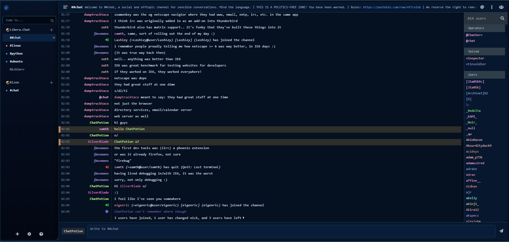 |
| Monokai Pro | 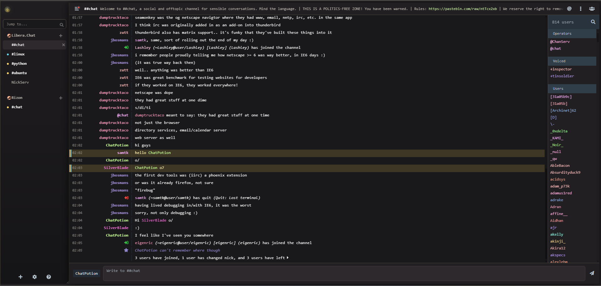 |
| Nord Frost | 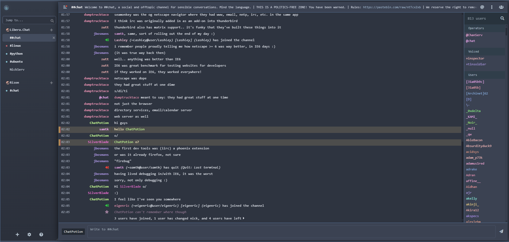 |
| One Dark Pro | 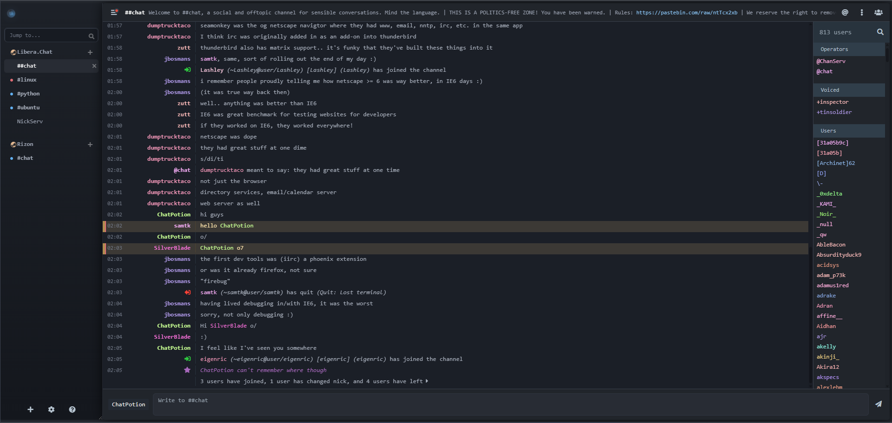 |
| Rosé Pine Moon | 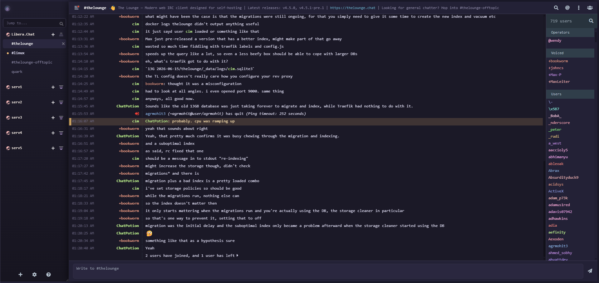 |
| Solarized Night | 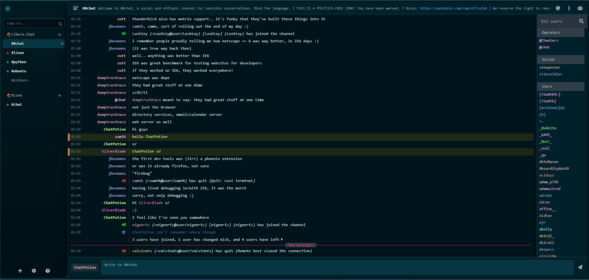 |
| Synthwave Sunset | 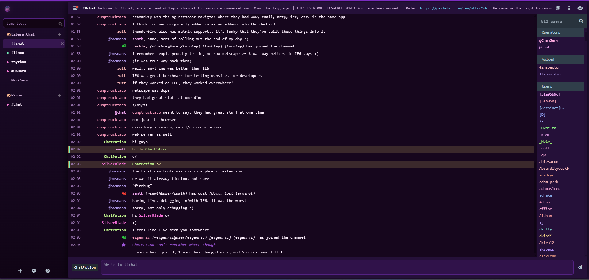 |
| Tokyo Night |  |

</details>

## Themes Included

- Arctic Aurora
- Ayu Mirage
- Catppuccin Mocha
- Crimson Noir
- Cyberpunk Neon
- Deep Sea Cyan
- Dracula Soft
- Everforest Dark
- Forest Night
- GitHub Dark
- Gruvbox Material
- Kanagawa Wave
- Matrix Terminal
- Midnight Sapphire
- Monokai Pro
- Nord Frost
- One Dark Pro
- Rosé Pine Moon
- Solarized Night
- Synthwave Sunset
- Tokyo Night

## Features

- 21 custom themes for The Lounge
- Clean dark interface styling
- Halloy-inspired sidebar appearance
- Improved unread message dots
- Separate mention/ping indicators
- Themed recent mentions panel
- Improved context menu readability
- Fixed private message highlight behavior
- Better image preview overlay styling
- Responsive layout adjustments

## Installation

1. Open The Lounge.
2. Go to **Settings**.
3. Set the base theme to **Morning** for the best result.
4. Open **Custom Stylesheet**.
5. Copy the CSS from any file inside the `themes` folder.
6. Paste it into the custom stylesheet box.
7. Save and refresh The Lounge.

## Recommended Base Theme

ChatPotion works best when applied over The Lounge's **Morning** theme.

AMOLED-based setups may also work well, but AMOLED is not a default The Lounge theme.

## Support

ChatPotion is free and open source. If you like the project and want to support future updates, you can donate here:

* **Bitcoin:** `152t9E459z3o2C7Nt5ZsFCgfV6YcKtEph8`
* **Ethereum:** `0xf5e3dc3f7b421f66fd53b83a1e24dfe0f3b06103`
* **Solana:** `DwkYxTJ33QUzuuDP4GLJNSzLWD3wUHjiCyiW4ztzYcwW`
* **Dogecoin:** `DRyszSw99c7z82nfZBjrCgdPmc5QGymC74`
* **Litecoin:** `LQLoyKQuyd2gCGrNn6FLfVjjHuUz5oPXnm`

Please double-check the address and network before sending. Crypto transactions cannot be reversed.

If you would like to be added to the supporters list, you can contact me at `acidvoltax@proton.me`.

## Folder Structure

```text
ChatPotion
├── themes
├── screenshots
├── README.md
├── LICENSE
├── CHANGELOG.md
└── .gitignore
```

## Notes

These themes are designed for The Lounge’s custom stylesheet feature. They are not official The Lounge themes or plugins.

## Author

Made by **ggvolta**.

## License

This project is licensed under the MIT License.
